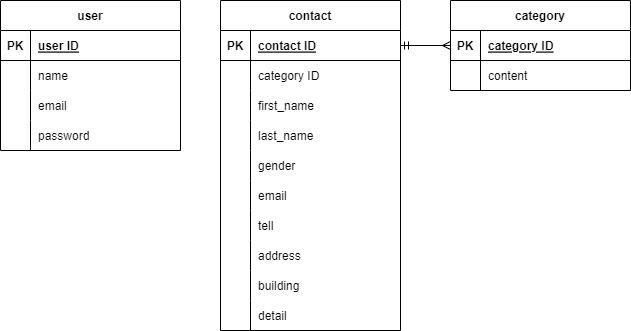

# お問い合わせフォーム

## 背景・目的
基礎学習タームの復習や自身の実力確認のために実施。

## アプリケーション機能の概要
**ユーザー**  
* 専用フォームからお問い合わせが可能（個人情報も一緒に記入）

**管理者**
* 管理者登録
* ユーザー情報とお問い合わせ内容の閲覧

## 環境構築
**Dockerビルド**
1. `git clone git@github.com:coachtech-material/laravel-docker-template.git`
2. リモートリポジトリ作成
3. リモートリポジトリとローカルリポジトリの紐付け
4. `docker-compose up -d --build`

**Larabel環境構築**
1. `docker-compose exec php bash`：PHPコンテナにログイン
2. `composer install`：composerのインストール
3. .env.exampleファイルから.envファイルを作成し、環境変数を設定
4. `php artisan key:generate`：アプリケーションキーの生成
5. `php artisan make:migration ~マイグレーションファイル名~`：マイグレーションファイル作成
6. `php artisan migrate`：マイグレーションの実行
7. `php artisan make:seeder ~シーダーファイル名~`：シーダーファイル作成
8. `php artisan db:seed`：シーディングの実行 
9. `php artisan make:controller ~コントローラ名~`：コントローラ作成
10. `php artisan make:model ~モデル名~`：モデル作成
11. `php artisan make:request ~リクエストファイル名~`：リクエストファイル作成

&ensp;※`sudu chmod -R 777 src/*`：ファイルアクセス権限を付与

## 使用技術
* laravel 8.83.8
* PHP 7.4.9
* MySQL 8.0.26
* nginx 1.21.1
* phpMyadmin
* diagrams.net

## ER図

## URL
* 開発環境：http://localhost
* phpMyAdmin：http://localhost:8080/
